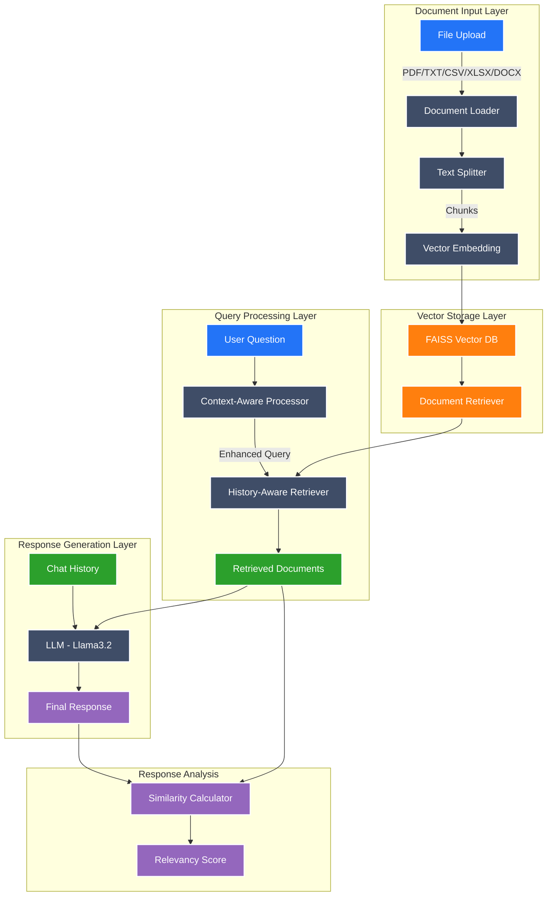

# Multi-Format Document Chat 📚

A powerful Streamlit-based application that enables interactive conversations with multiple document formats using LangChain and local LLM integration. This application allows users to upload various document types and engage in context-aware conversations about their content.

## Features 🌟

- **Multi-Format Support**: Process various document formats including:
  - PDF (.pdf)
  - Text files (.txt)
  - CSV files (.csv)
  - Excel files (.xlsx, .xls)
  - Word documents (.docx, .doc)

- **Advanced Document Processing**:
  - Automatic text splitting with smart chunk overlap
  - Vector embeddings using HuggingFace's sentence transformers
  - Local vector storage using FAISS

- **Interactive Chat Interface**:
  - Context-aware conversations
  - Source document attribution
  - Chat history management
  - Relevancy scoring for responses

- **User-Friendly Features**:
  - Real-time document processing
  - Source verification
  - Response relevancy calculation
  - Clean and intuitive UI

## Installation 🛠️

1. Clone the repository:
```bash
git clone <your-repository-url>
cd <repository-name>
```

2. Install required dependencies:
```bash
pip install -r requirements.txt
```

3. Install Ollama and download the required model:
```bash
# Install Ollama (instructions vary by OS)
ollama pull llama3.2
```

## Required Dependencies 📦

- streamlit
- langchain
- langchain-community
- langchain-core
- sentence-transformers
- faiss-cpu
- ollama
- pandas
- python-docx
- pypdf
- openpyxl

## Usage 🚀

1. Start the application:
```bash
streamlit run main.py
```

2. Upload documents through the sidebar interface

3. Click "Process Documents" to initialize the vector database

4. Start chatting with your documents!

## Features in Detail 🔍

### Document Processing
- Automatic text chunking for optimal processing
- Smart overlap for context preservation
- Metadata preservation for source attribution

### Chat Interface
- Real-time response generation
- Context-aware conversations
- Chat history tracking
- Source document verification

### Quality Assurance
- Relevancy scoring using cosine similarity
- Source document display
- Response verification capabilities

## Architecture 🏗️

The application is built using several key components:

1. **Document Processing Pipeline**:
   - File upload handling
   - Text extraction
   - Chunking
   - Vector embedding

2. **Vector Database**:
   - FAISS for efficient similarity search
   - Local storage for quick access

3. **Conversation Chain**:
   - Context-aware retrieval
   - History-aware processing
   - Response generation

4. **User Interface**:
   - Streamlit-based frontend
   - Responsive chat interface
   - Document management sidebar

## Contributing 🤝

Contributions are welcome! Please feel free to submit a Pull Request.

## License 📄

MIT License

Copyright (c) 2024 Mark Lumba

Permission is hereby granted, free of charge, to any person obtaining a copy
of this software and associated documentation files (the "Software"), to deal
in the Software without restriction, including without limitation the rights
to use, copy, modify, merge, publish, distribute, sublicense, and/or sell
copies of the Software, and to permit persons to whom the Software is
furnished to do so, subject to the following conditions:

The above copyright notice and this permission notice shall be included in all
copies or substantial portions of the Software.

THE SOFTWARE IS PROVIDED "AS IS", WITHOUT WARRANTY OF ANY KIND, EXPRESS OR
IMPLIED, INCLUDING BUT NOT LIMITED TO THE WARRANTIES OF MERCHANTABILITY,
FITNESS FOR A PARTICULAR PURPOSE AND NONINFRINGEMENT. IN NO EVENT SHALL THE
AUTHORS OR COPYRIGHT HOLDERS BE LIABLE FOR ANY CLAIM, DAMAGES OR OTHER
LIABILITY, WHETHER IN AN ACTION OF CONTRACT, TORT OR OTHERWISE, ARISING FROM,
OUT OF OR IN CONNECTION WITH THE SOFTWARE OR THE USE OR OTHER DEALINGS IN THE
SOFTWARE.

## Support 💬

For support, please [create an issue](your-repository-url/issues) in the repository.

## Acknowledgments 🙏

- LangChain for the excellent RAG framework
- Streamlit for the intuitive UI framework
- HuggingFace for transformer models
- Ollama for local LLM support

## Sample Screenshot Demo 🎥


# RAG (Retrieval Augmented Generation) Architecture



Built with ❤️ using Python, Streamlit, and LangChain
